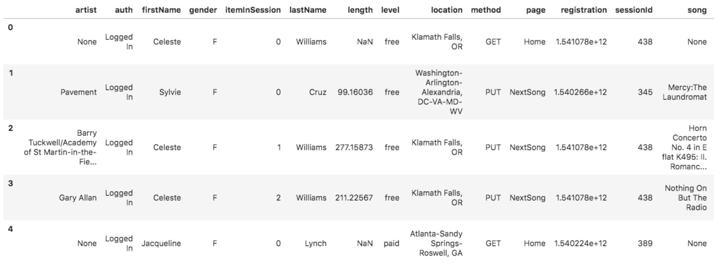

# Project: Data Lake with Spark

## Table of Contents
1. [Project Overview](#project-overview)
2. [Project Datasets](#project-datasets)
3. [Data Modeling](#data-modeling)
4. [Files](#files)
5. [How to run the scripts](#how-to-run-the-scripts)


## Project Overview

<p>The music streaming startup, Sparkify, has grown their user base and song database even more. Now they want to move their data warehouse to a data lake. 
Therefore the data resides in S3, in a directory of JSON logs on user activity on the app, as well as a directory with JSON metadata on the songs in their app.</p>

<p>Hence, Sparkify wants us to build an ETL pipeline that extracts their data from S3, processes them using Spark, and loads the data back into S3 as a set of dimensional tables. This will allow their analytics team to continue finding insights in what songs their users are listening to.</p>


## Project Datasets

### Song Dataset

Each file is in JSON format and contains metadata about the song and the artist.

The files are partitioned by the first three letters of each song's track ID. For example, here are filepaths to two files in this dataset.

>**s3://udacity-dend/song_data/A/B/C/TRABCEI128F424C983.json**<br>
>**s3://udacity-dend/song_data/A/A/B/TRAABJL12903CDCF1A.json**

The files are partitioned by the first three letters of each song's track ID. For example, here are filepaths to two files in this dataset.

>**s3://udacity-dend/song_data/A/B/C/TRABCEI128F424C983.json**<br>
>**s3://udacity-dend/song_data/A/A/B/TRAABJL12903CDCF1A.json**

Below is an example of what a single song file, **TRAABJL12903CDCF1A.json**, looks like.<br>
```
{
    "num_songs": 1, 
    "artist_id": "ARJIE2Y1187B994AB7", 
    "artist_latitude": null, 
    "artist_longitude": null, 
    "artist_location": "", 
    "artist_name": "Line Renaud", 
    "song_id": "SOUPIRU12A6D4FA1E1", 
    "title": "Der Kleine Dompfaff", 
    "duration": 152.92036, <br>
    "year": 0    
}
```

### Log Dataset

Based on the songs in the dataset above. These simulate activity logs from a music streaming app based on specified configurations.

The log files in the dataset are partitioned by year and month. For example, here are filepaths to two files in this dataset.

>**s3://udacity-dend/log_data/2018/11/2018-11-12-events.json**<br>
>**s3://udacity-dend/log_data/2018/11/2018-11-13-events.json**

Below is an example of what the data in a log file, **2018-11-12-events.json**, looks like.


## Data Modeling


## <br>Data Lake to store extracted dimentional tables
>"s3a://udacity-de-sparkify-data-lake/songs" <br>
>"s3a://udacity-de-sparkify-data-lake/time" <br>
>"s3a://udacity-de-sparkify-data-lake/users" <br>
>"s3a://udacity-de-sparkify-data-lake/songplays"**<br>
>**"s3a://udacity-de-sparkify-data-lake/artists" <br>


## <br>Files

The project contains 5 importan files:

**1. dl.cfg**                    Contains the Secret Key for ASW access<br>
**2. create_bucket.py**          Create bucket in AWS S3 to store the extracted dimentional tables.<br>
**3. etl.py**                    Loading song data and log data from S3 to Spark, transforms data into a set of dimensional tables, then save the table back to S3 <br>
**4. etl.ipynb**                 Used to design ETL pipelines <br>
**5. README.md**                 Provides project info<br>


## Build ETL Pipeline

**etl.py** will process the entire datasets.

Before it is required that you have the AWS credentials within the dl.cfg file.

## Instruction

1. Set **key** and **secrect** in **dwh.cfg** file <br><br>

2. Run **create_bucket.py**<br>
    **python create_bucket.py** <br> <br>
    
3. Use following command to start ETL process <br>
    **python etl.py** <br> <br>

OR Simply run through the notebook. 
   
    


